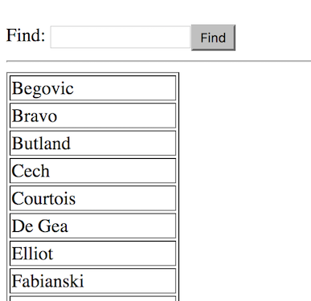

# Underscore Exercise 3 - Collection Functions

<!-- ## Fetch latest Repository Branch

```
$ cd /DRIVE/xampp/htdocs/UnderScore
$ git pull --no-edit https://github.com/noucampdotorgCSAD2018/UnderScore.git latest
$ ls
$ git status

``` -->

> Complete ALL the exercises in this section.

## Part 1 - ``find()``

1.	Examine and open the file [http://localhost/UnderScore/playerFind.html](http://localhost/UnderScore/playerFind.html) and ``playerFind.js``.

1.	When the button is clicked add code to display all the player names on separate lines.

1.	Change the caption of the button to "Find Bravo".  Modify the code so when the button is pressed now use the ``find()`` function to find and display only the player called "Bravo".

1.	What happens if you try to find a player whos name does not exist?  Ensure no console errors appear.

1.	Add a text box before the *Find* button as shown here:

	

	Update your code so you can search for any player's name typed into this box. Only search when *Find* button is pressed.

1.	Attempt to implement the search so that as you type text the **fist player name** that matches the current text in the textbox is shown.  You'll need to use the ``onkeyup`` event and use the JavaScript string function [includes()](https://www.w3schools.com/jsref/jsref_includes.asp) in your solution.


## Part 2 - ``findWhere()``

1.	Examine and open the file [http://localhost/UnderScore/playerWhere.html](http://localhost/UnderScore/playerWhere.html) and ``playerWhere.js``.

1.	Modify the code so that a user can search for the first player by *team* and *position* e.g. ``LIV`` and ``Forward`` should return *Firmino*.

